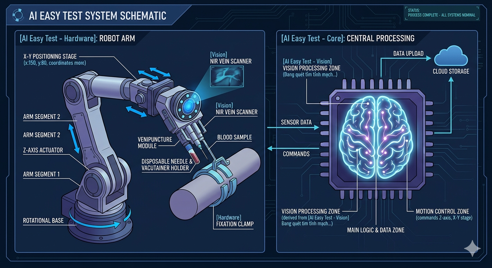
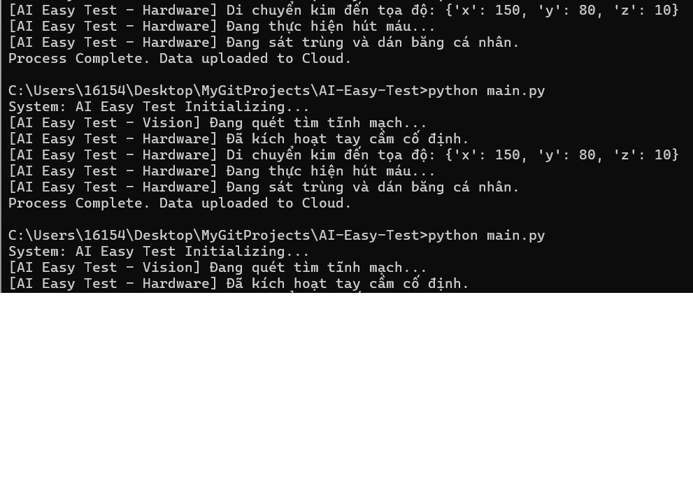

## 📊 System Visualization


# AI Easy Test: Autonomous Robotic Phlebotomy System

**AI Easy Test** is an AI-powered medical robot designed to automate the blood testing process, ensuring precision, safety, and speed.

## 🚀 Key Features
- **AI Navigation:** Moves autonomously using a wheeled base and LIDAR.
- **Vessel Detection:** Uses Computer Vision + NIR Laser to locate veins accurately.
- **Precision Phlebotomy:** Robotic fingers inside a stabilization handle to draw blood.
- **Fast Test Box:** Integrated Point-of-Care testing for immediate results.
- **IoT Connected:** Real-time data sync via Wi-Fi to hospital systems.

## 🛠 Tech Stack
- **Languages:** Python, C++ (Arduino)
- **AI/CV:** OpenCV, TensorFlow Lite
- **Hardware:** Raspberry Pi 5 (Main Brain), Arduino Mega (Motor Control), NIR Camera.

## 💻 Terminal Output Demo


## ⚙️ Installation
1. Clone the repo:
   ```bash
   git clone https://github.com
   ```
2. Install dependencies:
   ```bash
   pip install -r requirements.txt
   ```

## ⚠️ Disclaimer
This project is for educational and research purposes. Medical use requires FDA/CE certification.
